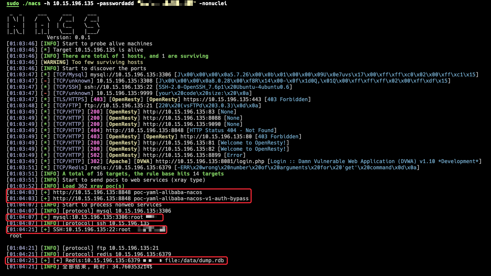

# nacs
全功能内网扫描器

# 功能
- 探活
- 服务扫描(常规&非常规端口)
- poc探测(xray&nuclei格式)
- 数据库等弱口令爆破
- 内网常见漏洞利用

# 利用过程(部分未实现)
    环境配置
        弱口令配置、要写入的公钥、反弹的地址、DNSLog的地址等
    探活
        icmp ping
    资产初筛
        确定哪个端口对应哪种服务，尤其注意非常规端口
    漏洞打点
        可以RCE的非web服务 进行探测或者利用(redis、永恒之蓝等)
        web服务 扫poc
        非web服务 未授权及爆破
        web服务 自动爆破登录
        重点服务 OA、VPN、Weblogic、蜜罐等


# 使用方法
快速使用
```shell
./nacs -h IP或IP段
./nacs -hf IP或IP段的文件
输出功能没实现 先这样重定向一下
./nacs -hf ip.txt -nonuclei -nobrute > output_withcolor.txt
cat output_withcolor.txt | sed -r "s/\x1B\[([0-9]{1,3}(;[0-9]{1,2})?)?[mGK]//g" > output_withoutcolor.txt
```
常用参数
```shell
-np 不探活, 直接扫端口
-xraypocpath xray(v1)的poc路径 格式为"web/pocs/"
-nucleipocpath nuclei的poc路径 格式为"xxx/pocs/**"
-nopoc 不进行poc探测, 包括xray与nuclei
-nonuclei [强烈建议加上此参数!!!]不使用nuclei进行探测, 因为nuclei的poc太多了
-nobrute 不进行爆破
-pocdebug poc探测时打印全部信息
-brutedebug 爆破时打印全部信息
-useradd 爆破时添加用户名
-passwordadd 爆破时添加密码
```

# 借鉴
- [x] fscan https://github.com/shadow1ng/fscan 专注于内网 web和服务的poc 服务的爆破
- [x] kscan https://github.com/lcvvvv/kscan 专注于信息收集 能探测到非常规端口开的服务 比如2222的ssh
- [x] dismap https://github.com/zhzyker/dismap 资产收集
- [ ] Ladon https://github.com/k8gege/LadonGo
- [x] xray https://github.com/chaitin/xray 主动/被动扫常见web漏洞 扫poc
- [ ] goby https://cn.gobies.org/
- [x] vulmap https://github.com/zhzyker/vulmap
- [ ] nali https://github.com/zu1k/nali 查询IP地理信息和CDN提供商
- [ ] ehole https://github.com/EdgeSecurityTeam/EHole 重点攻击系统指纹探测 暂时不能用了
- [x] Nuclei https://github.com/projectdiscovery/nuclei 基于poc的快速扫描
- [x] pocV https://github.com/WAY29/pocV 能扫描xray和nuclei的poc
- [x] afrog https://github.com/zan8in/afrog CVE、CNVD、默认口令、信息泄露、指纹识别、未授权访问、任意文件读取、命令执行
- [ ] woodpecker https://github.com/Ciyfly/woodpecker
- [x] xray-poc-scan-engine https://github.com/h1iba1/xray-poc-scan-engine
- [x] pocassist https://github.com/jweny/pocassist 可视化编辑导入和运行
- [ ] Aopo https://github.com/ExpLangcn/Aopo
- [x] SpringExploit https://github.com/SummerSec/SpringExploit

# TODO
- [ ] 支持xrayV2, 本来想参考pocV, 不过不太稳定, 暂时先用fscan的v1版本
- [ ] 弱口令自动生成, 根据前缀、后缀、已获得信息等来动态补充爆破的字典
- [ ] 常见Spring漏洞的自动利用
- [ ] 简单的web登录服务自动探测接口及参数实现爆破
- [ ] 完善日志输出功能(目前几乎没实现输出到文件的功能)
- [ ] ... 

三五天写出来的, 肯定存在大量bug, 但目前基本使用是没问题的, 师傅们多多提建议!
