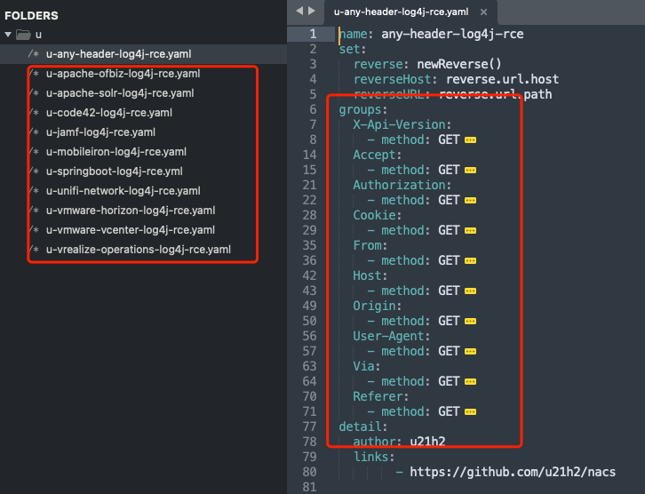
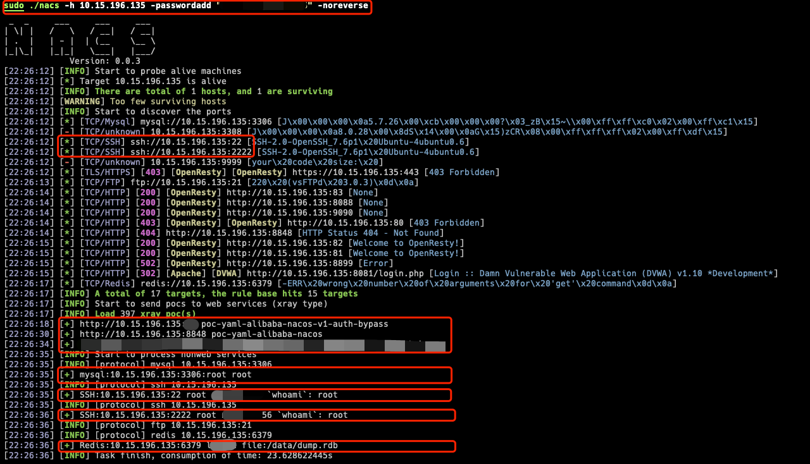
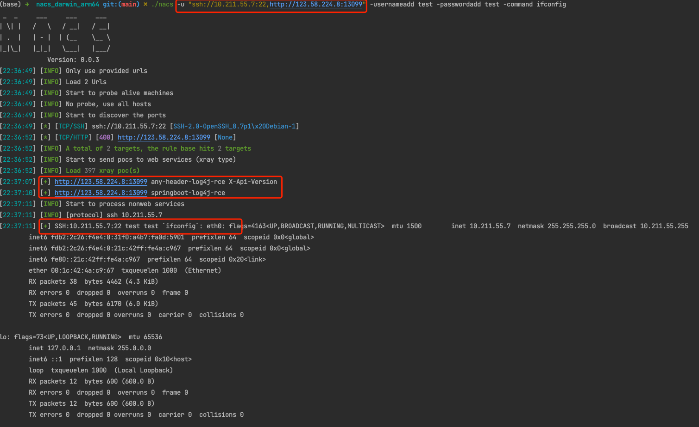

# nacs 事件驱动的扫描器

[[中文 Readme]](https://github.com/u21h2/nacs/blob/main/README.md)
|
[[English Readme]](https://github.com/u21h2/nacs/blob/main/README_EN.md)


<a href="https://github.com/u21h2/nacs"></a>
<a href="https://github.com/u21h2/nacs"></a>
<a href="https://github.com/u21h2/nacs/releases"></a>
<a href="https://github.com/u21h2/nacs"></a>

## ✨ 功能
- 探活
- 服务扫描(常规&非常规端口)
- poc探测(xray&nuclei格式)
- 数据库等弱口令爆破
- 内网常见漏洞利用


## ⭐️ 亮点
- 常见组件及常见HTTP请求头的log4j漏洞检测
  
- 非常规端口的服务扫描和利用(比如2222端口的ssh等等)
- 识别为公网IP时, 从fofa检索可用的资产作为扫描的补充(正在写)
- 自动识别简单web页面的输入框，用于弱口令爆破及log4j的检测(正在写)


# 利用过程
    环境配置
        弱口令配置、要写入的公钥、反弹的地址、ceye的API等等
    探活
        icmp ping
    资产初筛
        确定哪个端口对应哪种服务，尤其是非常规端口
    漏洞打点(根据指纹信息发送到相应的模块)
        可以RCE的非web服务 进行探测或者利用(redis、永恒之蓝等)
        web服务 扫poc 如log4j
        非web服务 未授权及爆破
        web服务 自动爆破登录 (未实现)
        重点服务 OA、VPN、Weblogic、蜜罐等


## 使用方法

### 快速使用
```
sudo ./nacs -h IP或IP段 -o result.txt
sudo ./nacs -hf IP或IP段的文件 -o result.txt
sudo ./nacs -u url(支持http、ssh、ftp、smb等) -o result.txt
sudo ./nacs -uf url文件 -o result.txt
```

### 示例
- (1) 添加目标IP: 对10.15.196.135机器进行扫描, 手动添加密码, 并关闭反连平台的测试(即不测试log4j等)
    ```
    sudo ./nacs -h 10.15.196.135 -passwordadd "xxx,xxx" -noreverse
    ```
    
    可见发现了nacos的权限绕过漏洞，以及各服务爆破成功

- (2) 直接添加目标url: 对10.211.55.7的ssh端口进行爆破,添加用户名密码均为test,爆破成功后执行ifconfig;并对某靶场url尝试log4j漏洞
  ```
  sudo ./nacs -u "ssh://10.211.55.7:22,http://123.58.224.8:13099" -usernameadd test -passwordadd test -command ifconfig
  ```
  
  可见两个log4j的poc都检测成功了,注入点在请求头的X-Api-Version字段；ssh爆破也成功了
    
### 常用参数
```
-o 指定输出的日志文件
-np 不探活, 直接扫端口
-po 只使用这些端口
-pa 添加这些端口
-fscanpocpath fscan的poc路径 格式为"web/pocs/"
-nucleipocpath nuclei的poc路径 格式为"xxx/pocs/**"
-nopoc 不进行poc探测, 包括xray与nuclei
-nuclei 使用nuclei进行探测(不强烈建议加上此参数,因为nuclei的poc太多了)
-nobrute 不进行爆破
-pocdebug poc探测时打印全部信息
-brutedebug 爆破时打印全部信息
-useradd 爆破时添加用户名
-passwordadd 爆破时添加密码
-noreverse 不使用反连平台
```

## 借鉴
借鉴参考了下列优秀作品
- [x] fscan https://github.com/shadow1ng/fscan 专注于内网 web和服务的poc 服务的爆破
- [x] kscan https://github.com/lcvvvv/kscan 专注于信息收集 能探测到非常规端口开的服务 比如2222的ssh
- [x] dismap https://github.com/zhzyker/dismap 资产收集
- [ ] Ladon https://github.com/k8gege/LadonGo
- [x] xray https://github.com/chaitin/xray 主动/被动扫常见web漏洞 扫poc
- [ ] goby https://cn.gobies.org/
- [x] vulmap https://github.com/zhzyker/vulmap
- [ ] nali https://github.com/zu1k/nali 查询IP地理信息和CDN提供商
- [ ] ehole https://github.com/EdgeSecurityTeam/EHole 重点攻击系统指纹探测 暂时不能用了
- [x] Nuclei https://github.com/projectdiscovery/nuclei 基于poc的快速扫描
- [x] pocV https://github.com/WAY29/pocV 能扫描xray和nuclei的poc
- [x] afrog https://github.com/zan8in/afrog CVE、CNVD、默认口令、信息泄露、指纹识别、未授权访问、任意文件读取、命令执行
- [ ] woodpecker https://github.com/Ciyfly/woodpecker
- [x] xray-poc-scan-engine https://github.com/h1iba1/xray-poc-scan-engine
- [x] pocassist https://github.com/jweny/pocassist 可视化编辑导入和运行
- [ ] Aopo https://github.com/ExpLangcn/Aopo
- [x] SpringExploit https://github.com/SummerSec/SpringExploit
- [ ] fscanpoc补充 https://github.com/chaosec2021/fscan-POC


# TODO 动态更新
- [ ] 从fofa中自动扫描搜集资产补充到扫描结果
- [ ] 支持自定义header来进行host碰撞等
- [ ] 完善代理功能
- [ ] 加进度条
- [ ] 支持xrayV2, 本来想参考pocV, 不过不太稳定, 暂时先用fscan的v1版本
- [ ] 弱口令自动生成, 根据前缀、后缀、已获得信息等来动态补充爆破的字典
- [ ] 常见Spring漏洞的自动利用
- [ ] 简单的web登录服务自动探测接口及参数实现爆破
- [ ] ...

# 免责声明
本工具仅面向合法授权的企业安全建设行为，如您需要测试本工具的可用性，请自行搭建靶机环境。
为避免被恶意使用，本项目所有收录的poc均为漏洞的理论判断，不存在漏洞利用过程，不会对目标发起真实攻击和漏洞利用。
在使用本工具进行检测时，您应确保该行为符合当地的法律法规，并且已经取得了足够的授权。请勿对非授权目标进行扫描。
如您在使用本工具的过程中存在任何非法行为，您需自行承担相应后果，我们将不承担任何法律及连带责任。


# Stargazers over time
## 访问

## Star
[](https://starchart.cc/u21h2/nacs)
